# Product Requirements Document (PRD)

**Product**: AlgoViz — Algorithm Visualizer for Coding Interview Preparation  
**Version**: 1.0.0  
**Date**: March 19, 2026  
**Author**: Sai Likhith K  
**Status**: Released  

---

## Table of Contents

1. [Executive Summary](#1-executive-summary)
2. [Problem Statement](#2-problem-statement)
3. [Target Users](#3-target-users)
4. [Product Overview](#4-product-overview)
5. [User Stories](#5-user-stories)
6. [Functional Requirements](#6-functional-requirements)
7. [System Architecture](#7-system-architecture)
8. [Detection Engine — Deep Dive](#8-detection-engine--deep-dive)
9. [Visualization Engine — Deep Dive](#9-visualization-engine--deep-dive)
10. [UI/UX Specifications](#10-uiux-specifications)
11. [Product Screenshots](#11-product-screenshots)
12. [Data Flow](#12-data-flow)
13. [Algorithm Coverage Matrix](#13-algorithm-coverage-matrix)
14. [Technical Specifications](#14-technical-specifications)
15. [Performance Requirements](#15-performance-requirements)
16. [Non-Functional Requirements](#16-non-functional-requirements)
17. [Known Limitations](#17-known-limitations)
18. [Success Metrics](#18-success-metrics)
19. [Glossary](#19-glossary)

---

## 1. Executive Summary

AlgoViz is a browser-based tool that transforms static Python algorithm code into dynamic, step-by-step visual animations. The user pastes Python code (e.g., a LeetCode solution), clicks "Visualize," and the application:

1. **Auto-detects** which algorithm and data structure the code implements
2. **Extracts** input data (arrays, graphs, trees) from the code
3. **Generates** a sequence of visualization steps representing every operation
4. **Animates** the visualization with playback controls (play, pause, step, speed)
5. **Displays** time/space complexity and algorithm metadata

The entire application runs in the browser — no server-side code execution. The backend serves static files only.

---

## 2. Problem Statement

### The Gap

When preparing for coding interviews, engineers write algorithm solutions but struggle to:

- **Mentally trace** complex algorithms (merge sort recursion, graph traversals, DP table filling)
- **Verify correctness** without running the code and printing intermediate state
- **Build intuition** for how different algorithms behave on different inputs
- **Explain algorithms** to others without drawing on a whiteboard

### Existing Solutions and Their Shortcomings

| Tool | Limitation |
|---|---|
| VisuAlgo | Pre-built visualizations only — cannot paste your own code |
| Python Tutor | Shows memory model, not algorithm-specific visualization |
| Algorithm Visualizer (algorithm-visualizer.org) | Requires JavaScript, not Python |
| LeetCode debugger | Line-by-line execution, not visual |
| Whiteboard drawings | Static, time-consuming, not interactive |

### AlgoViz's Approach

AlgoViz bridges the gap by accepting **the user's own Python code** and automatically producing a visualization tailored to the detected algorithm. No pre-built demos, no language switching — paste your interview solution and see it animate.

---

## 3. Target Users

### Primary: Software Engineers Preparing for Coding Interviews

- Mid to senior-level engineers interviewing at FAANG/top-tier companies
- Need to deeply understand algorithm behavior, not just memorize solutions
- Write solutions in Python (the dominant interview language)
- Want to verify their understanding of edge cases and step-by-step flow

### Secondary: CS Students Learning Data Structures & Algorithms

- Undergraduate/graduate students taking DSA courses
- Benefit from visual explanations of textbook algorithms
- Use the built-in templates as learning material

### Tertiary: Educators and Interviewers

- Professors demonstrating algorithms in lectures
- Interviewers explaining optimal solutions to candidates

---

## 4. Product Overview

### Core Concept

```
┌──────────────────────┐     ┌──────────────────────┐     ┌──────────────────────┐
│                      │     │                      │     │                      │
│   Python Code        │────▶│   Detection Engine    │────▶│   Visualization      │
│   (user input)       │     │   (pattern matching)  │     │   (step animation)   │
│                      │     │                      │     │                      │
└──────────────────────┘     └──────────────────────┘     └──────────────────────┘
                                      │                            │
                                      ▼                            ▼
                              ┌──────────────┐            ┌──────────────────┐
                              │ Algorithm    │            │ Playback Controls│
                              │ Metadata     │            │ + Step Messages  │
                              │ (O, name...) │            │ + Info Panel     │
                              └──────────────┘            └──────────────────┘
```

### Key Differentiators

1. **Auto-detection from Python code** — no manual algorithm selection needed
2. **Multiple visualization modes** — bar charts, graph networks, tree diagrams, linked list chains (automatically chosen based on the detected data structure)
3. **Interview-focused** — covers the exact algorithms asked in FAANG interviews
4. **Zero setup** — runs entirely in the browser, no Python runtime needed
5. **Built-in templates** — 15 ready-to-go solutions for instant exploration

---

## 5. User Stories

### Must Have (P0)

| ID | Story | Acceptance Criteria |
|---|---|---|
| US-01 | As a user, I want to paste my Python sorting code and see it visualized as animated bars | Bars represent array values, comparisons highlighted in teal, swaps in red, sorted in purple |
| US-02 | As a user, I want the app to auto-detect which algorithm my code implements | Detection works for all 40+ supported patterns without user intervention |
| US-03 | As a user, I want play/pause controls to step through the algorithm at my pace | Play, pause, step forward, step backward, reset, speed adjustment all functional |
| US-04 | As a user, I want to see time and space complexity for the detected algorithm | Complexity displayed in the info panel with algorithm name and description |
| US-05 | As a user, I want to visualize graph algorithms (BFS/DFS) with actual nodes and edges | Graph rendered as circular node layout with directed edges and traversal highlighting |
| US-06 | As a user, I want to see tree traversals animated on a visual tree | Tree rendered with proper parent-child layout, nodes glow when visited |

### Should Have (P1)

| ID | Story | Acceptance Criteria |
|---|---|---|
| US-07 | As a user, I want pre-built templates so I can quickly explore algorithms | 15 templates across 9 categories accessible from dropdown menus |
| US-08 | As a user, I want to see DP table filling visualized | Array bars grow as DP values are computed, with step messages showing the recurrence |
| US-09 | As a user, I want linked list operations visualized as node chains | Nodes connected by arrows, pointer labels shown, active node highlighted |
| US-10 | As a user, I want two-pointer and sliding window patterns visualized | Pointer positions labeled under bars, window range highlighted |

### Nice to Have (P2)

| ID | Story | Acceptance Criteria |
|---|---|---|
| US-11 | As a user, I want to scrub the timeline to any step | Progress slider allows jumping to any step in the sequence |
| US-12 | As a user, I want step messages that explain what's happening | Every step has a human-readable message (e.g., "Comparing 64 and 34") |

---

## 6. Functional Requirements

### FR-01: Code Input

| Requirement | Details |
|---|---|
| Input method | Textarea with monospace font and line numbers |
| Language supported | Python (pattern matching against Python syntax) |
| Max code length | No hard limit (browser memory is the constraint) |
| Default content | Bubble Sort sample loaded on first visit |
| Character encoding | UTF-8 |

### FR-02: Algorithm Detection

| Requirement | Details |
|---|---|
| Detection method | Regex pattern matching with priority scoring |
| Pattern count | 40+ patterns across 18 categories |
| Priority range | 1 (weak/generic) to 10 (exact name match) |
| Conflict resolution | Highest priority match wins |
| Fallback | "Unknown Algorithm" with generic message if no patterns match |
| Speed | Synchronous, sub-millisecond on typical code |

### FR-03: Data Extraction

| Requirement | Details |
|---|---|
| Array extraction | Matches `[num, num, ...]` patterns in code |
| Graph extraction | Parses adjacency list dictionaries `{'A': ['B', 'C']}` |
| Tree extraction | Finds `insert(value)` calls and builds BST |
| Default data | Each algorithm type has a fallback dataset if extraction fails |

### FR-04: Visualization Generation

| Requirement | Details |
|---|---|
| Implementation | JavaScript generator functions (`function*`) |
| Step granularity | One step per atomic operation (comparison, swap, visit, etc.) |
| Step data | Array state, highlighted indices, pointers, message, phase |
| Memory | All steps pre-generated and stored in an array for random access |

### FR-05: Playback Controls

| Control | Behavior |
|---|---|
| Play | Advances steps at the current speed interval |
| Pause | Stops auto-advancement |
| Step Forward | Advances by one step |
| Step Backward | Goes back by one step |
| Reset | Returns to step 0, stops playback |
| Progress Slider | Jump to any step (pauses playback) |
| Speed Slider | Adjusts interval from 50ms (fast) to 1000ms (slow) |

### FR-06: Visualization Rendering

| Visualizer | Technology | Used for |
|---|---|---|
| ArrayVisualizer | Framer Motion + React | Sorting, searching, DP, two pointers, sliding window, stack |
| GraphVisualizer | HTML5 Canvas | BFS, DFS, Dijkstra, topological sort |
| TreeVisualizer | HTML5 Canvas | BST operations, all traversal orders |
| LinkedListVisualizer | Framer Motion + React | Reverse linked list, cycle detection |

### FR-07: Algorithm Info Panel

| Field | Source | Example |
|---|---|---|
| Algorithm name | Detection engine | "Merge Sort" |
| Time complexity | Detection engine | "O(n log n)" |
| Space complexity | Detection engine | "O(n)" |
| Category | Detection engine | "sorting" |
| Description | Detection engine | "Divides array in half, sorts each half, then merges them." |

### FR-08: Sample Templates

| Requirement | Details |
|---|---|
| Count | 15 templates |
| Categories | 9 (Sorting, Searching, Graph, Tree, DP, Linked List, Two Pointers, Sliding Window, Stack & Queue) |
| Access method | Category dropdown menus at the top of the left panel |
| Behavior | Selecting a template loads code, auto-detects, and generates visualization |

---

## 7. System Architecture

### High-Level Architecture

```
┌─────────────────────────────────────────────────────────────┐
│                         BROWSER                              │
│                                                              │
│  ┌───────────────┐  ┌─────────────────┐  ┌───────────────┐ │
│  │  Code Editor   │  │ Algorithm       │  │ Visualization │ │
│  │  (textarea)    │─▶│ Detector        │─▶│ Engine        │ │
│  │               │  │ (regex engine)  │  │ (generators)  │ │
│  └───────────────┘  └─────────────────┘  └───────┬───────┘ │
│                                                    │         │
│                              ┌─────────────────────┘         │
│                              ▼                               │
│  ┌─────────────────────────────────────────────────────────┐│
│  │              Visualization Renderers                     ││
│  │                                                          ││
│  │  ┌─────────┐ ┌─────────┐ ┌─────────┐ ┌──────────────┐ ││
│  │  │ Array   │ │ Graph   │ │  Tree   │ │ Linked List  │ ││
│  │  │ (React) │ │(Canvas) │ │(Canvas) │ │   (React)    │ ││
│  │  └─────────┘ └─────────┘ └─────────┘ └──────────────┘ ││
│  └─────────────────────────────────────────────────────────┘│
│                                                              │
│  ┌────────────────────────┐  ┌────────────────────────────┐ │
│  │ Playback Controller    │  │  Info Panel                │ │
│  │ (React state + timer)  │  │  (complexity, description) │ │
│  └────────────────────────┘  └────────────────────────────┘ │
└─────────────────────────────────────────────────────────────┘
                              │
                    Static file serving only
                              │
┌─────────────────────────────────────────────────────────────┐
│                      EXPRESS SERVER                           │
│                 (serves built React app)                      │
└─────────────────────────────────────────────────────────────┘
```

### Module Dependency Graph

```
home.tsx (Main Page)
  ├── algorithmDetector.ts    ← detects algorithm from code
  │   └── returns: DetectedAlgorithm { type, category, name, complexity, description }
  ├── visualizationEngine.ts  ← generates step sequence
  │   └── returns: Generator<VisualizationStep>
  ├── sampleCode.ts           ← pre-built Python templates
  ├── ArrayVisualizer.tsx     ← renders bar chart
  ├── GraphVisualizer.tsx     ← renders graph network
  ├── TreeVisualizer.tsx      ← renders binary tree
  └── LinkedListVisualizer.tsx ← renders linked list chain
```

### File Structure

```
algo-visualizer/
├── client/
│   ├── index.html                          # HTML shell with Google Fonts
│   └── src/
│       ├── App.tsx                         # Router, dark mode initialization
│       ├── main.tsx                        # React entry point
│       ├── index.css                       # Tailwind directives + dark neon theme
│       │
│       ├── pages/
│       │   ├── home.tsx                    # Main page (530 lines)
│       │   │                               #   - Code editor panel
│       │   │                               #   - Template selector
│       │   │                               #   - Visualization panel
│       │   │                               #   - Playback controls
│       │   │                               #   - Algorithm info panel
│       │   └── not-found.tsx               # 404 page
│       │
│       ├── components/
│       │   ├── ArrayVisualizer.tsx          # Bar chart (70 lines)
│       │   │   └── Framer Motion spring animations
│       │   │   └── Teal/purple/red color coding
│       │   │   └── Pointer labels below bars
│       │   │
│       │   ├── GraphVisualizer.tsx          # Graph network (127 lines)
│       │   │   └── Canvas API rendering
│       │   │   └── Circular node layout (trigonometric)
│       │   │   └── Directed edge arrows
│       │   │   └── Node glow effects (shadowBlur)
│       │   │   └── Queue/stack display overlay
│       │   │
│       │   ├── TreeVisualizer.tsx           # Binary tree (116 lines)
│       │   │   └── Canvas API rendering
│       │   │   └── Recursive layout (decreasing x-spread per level)
│       │   │   └── Edge drawing before nodes (proper layering)
│       │   │   └── Traversal result array at bottom
│       │   │
│       │   ├── LinkedListVisualizer.tsx     # Linked list (58 lines)
│       │   │   └── Horizontal node chain
│       │   │   └── Arrow connectors (CSS triangles)
│       │   │   └── Pointer labels (prev, curr, next)
│       │   │
│       │   ├── PerplexityAttribution.tsx    # Footer attribution
│       │   └── ui/                          # shadcn/ui components (30+ files)
│       │
│       ├── lib/
│       │   ├── algorithmDetector.ts         # Detection engine (509 lines)
│       │   │   └── 40+ regex patterns
│       │   │   └── Priority scoring system
│       │   │   └── Array/graph/tree data extractors
│       │   │
│       │   ├── visualizationEngine.ts       # Step generators (478 lines)
│       │   │   └── 16 generator functions
│       │   │   └── Sorting: bubble, selection, insertion, merge, quick
│       │   │   └── Searching: binary search
│       │   │   └── Graph: BFS, DFS
│       │   │   └── Tree: inorder, preorder, postorder
│       │   │   └── DP: fibonacci, coin change
│       │   │   └── Other: linked list reverse, stack, two pointers, sliding window
│       │   │
│       │   ├── sampleCode.ts                # 15 Python templates (331 lines)
│       │   ├── queryClient.ts               # TanStack Query config
│       │   └── utils.ts                     # Tailwind cn() helper
│       │
│       └── hooks/
│           ├── use-mobile.tsx               # Responsive breakpoint hook
│           └── use-toast.ts                 # Toast notification hook
│
├── server/
│   ├── index.ts                             # Express server entry
│   ├── routes.ts                            # API route registration
│   ├── storage.ts                           # Storage interface
│   ├── vite.ts                              # Vite dev middleware
│   └── static.ts                            # Static file serving
│
├── shared/
│   └── schema.ts                            # Drizzle ORM schema
│
├── docs/
│   ├── PRD.md                               # This document
│   ├── FUTURE_SCOPE.md                      # Roadmap and future features
│   └── screenshots/                         # Product screenshots
│
├── tailwind.config.ts                       # Tailwind + shadcn theme
├── vite.config.ts                           # Vite bundler config
├── tsconfig.json                            # TypeScript config
├── package.json                             # Dependencies
├── README.md                                # Project overview
├── FEATURES.md                              # Feature documentation
├── CONTRIBUTING.md                          # Contribution guide
├── CHANGELOG.md                             # Version history
└── LICENSE                                  # MIT License
```

---

## 8. Detection Engine — Deep Dive

### Architecture

The detection engine (`algorithmDetector.ts`) is a **prioritized pattern matcher** that scans Python source code against a registry of 40+ regex patterns.

### Pattern Structure

Each pattern is defined as:

```typescript
interface PatternMatch {
  pattern: RegExp;           // Regex to match against code
  type: AlgorithmType;       // Unique algorithm identifier
  category: AlgorithmCategory; // Algorithm family
  name: string;              // Human-readable name
  timeComplexity: string;    // Big-O time notation
  spaceComplexity: string;   // Big-O space notation
  description: string;       // One-line explanation
  dataStructure: DataStructureType; // Determines which visualizer to use
  priority: number;          // 1–10, higher = more specific match
}
```

### Priority Levels

| Level | Meaning | Example |
|---|---|---|
| 10 | Exact function name | `\bbubble_sort\b`, `\bdijkstra\b` |
| 9 | Strong structural match | `\bslow\b.*\bfast\b` (Floyd's cycle detection) |
| 8 | Identifiable pattern | `\binorder\b`, `\bheapq\b` with context |
| 6-7 | Moderate structural | `\bstack\b.*\bpush\b.*\bpop\b` |
| 5 | Weak structural | Nested loops with swap pattern |
| 3-4 | Generic/fallback | `\bdp\b = [` (could be any DP), `\bdict\b` |

### Detection Flow

```
Input: Python source code (string)
  │
  ▼
For each pattern in PATTERNS (40+ entries):
  │  Test pattern.regex against code
  │  If match → add to candidates with priority score
  │
  ▼
Sort candidates by priority (descending)
  │
  ▼
Return highest-priority match as DetectedAlgorithm
  │
  ▼
If no matches → return { type: 'unknown', ... }
```

### Conflict Resolution Example

Given code:
```python
def merge_sort(arr):
    dp = [0] * len(arr)
    # ... sorting logic with merge
```

| Pattern | Matches | Priority |
|---|---|---|
| `\bmerge.?sort\b` | Yes | 10 |
| `\bdp\b\s*=\s*\[` | Yes | 4 |

Result: **Merge Sort** (priority 10 wins over generic DP at priority 4).

### Data Extraction

After detecting the algorithm, the engine extracts input data:

| Extractor | Regex | Fallback |
|---|---|---|
| `extractArrayFromCode` | `/\[(\s*\d+\s*(?:,\s*\d+\s*)*)\]/` | `[64, 34, 25, 12, 22, 11, 90, 45, 78, 33]` |
| `extractGraphFromCode` | Adjacency list dict parsing | 6-node sample graph (A→F) |
| `extractTreeFromCode` | `insert\s*\(\s*(\d+)\s*\)` | BST from `[50, 30, 70, 20, 40, 60, 80]` |

### Category → Visualizer Mapping

| Category | Visualizer Component |
|---|---|
| `sorting`, `binary_search`, `searching` | ArrayVisualizer |
| `dynamic_programming`, `hash_map` | ArrayVisualizer |
| `two_pointers`, `sliding_window` | ArrayVisualizer |
| `stack_queue`, `greedy` | ArrayVisualizer |
| `graph` | GraphVisualizer |
| `tree` | TreeVisualizer |
| `linked_list` | LinkedListVisualizer |
| `heap` | ArrayVisualizer |
| `trie`, `union_find`, `segment_tree` | ArrayVisualizer (fallback) |
| `backtracking` | ArrayVisualizer (fallback) |

---

## 9. Visualization Engine — Deep Dive

### Architecture

The visualization engine (`visualizationEngine.ts`) uses **JavaScript generator functions** to produce a lazy sequence of steps. Each `yield` represents one frame of the visualization.

### VisualizationStep Interface

```typescript
interface VisualizationStep {
  // Array visualization
  array?: number[];          // Current array state
  highlights?: number[];     // Indices highlighted in teal
  swapping?: number[];       // Indices highlighted in red (swap)
  sorted?: number[];         // Indices highlighted in purple (finalized)
  pointers?: Record<string, number>; // Named pointer labels

  // Tree visualization
  treeHighlight?: number[];  // Node values currently active

  // Graph visualization
  graphVisited?: string[];   // Already-visited node names
  graphCurrent?: string;     // Currently-processing node
  graphQueue?: string[];     // Queue/stack contents
  graphEdgeHighlight?: [string, string][]; // Active edges

  // Linked list visualization
  linkedList?: { value: number; next?: boolean }[];
  llHighlight?: number;      // Active node index
  llPointers?: Record<string, number>; // Pointer labels

  // Universal
  message: string;           // Human-readable step explanation
  phase?: string;            // Step type (init, compare, swap, done, etc.)
}
```

### Generator Pattern

Each algorithm has a generator function:

```typescript
export function* bubbleSortSteps(arr: number[]): Generator<VisualizationStep> {
  const a = [...arr];
  yield { array: [...a], message: 'Starting Bubble Sort', phase: 'init' };

  for (let i = 0; i < n - 1; i++) {
    for (let j = 0; j < n - i - 1; j++) {
      yield { array: [...a], highlights: [j, j+1], message: `Comparing...` };
      if (a[j] > a[j+1]) {
        yield { array: [...a], swapping: [j, j+1], message: `Swapping...` };
        [a[j], a[j+1]] = [a[j+1], a[j]];
      }
    }
  }

  yield { array: [...a], sorted: ALL_INDICES, message: 'Complete!', phase: 'done' };
}
```

### Step Generation Pipeline

```
User clicks "Visualize"
  │
  ▼
detectAlgorithm(code) → DetectedAlgorithm
  │
  ▼
extractArrayFromCode(code) / extractGraphFromCode(code) / extractTreeFromCode(code)
  │
  ▼
Switch on algorithm type → call appropriate generator
  │
  ▼
Array.from(generator) → VisualizationStep[] (all steps materialized)
  │
  ▼
setSteps(allSteps), setCurrentStep(0)
  │
  ▼
React renders the appropriate visualizer with steps[currentStep]
```

### Step Counts by Algorithm

| Algorithm | Typical Step Count | Notes |
|---|---|---|
| Bubble Sort (8 elements) | ~69 steps | Every comparison + swap |
| Quick Sort (8 elements) | ~35 steps | Pivot selection + partitioning |
| Merge Sort (8 elements) | ~40 steps | Divide + merge operations |
| Binary Search (10 elements) | ~8 steps | O(log n) comparisons |
| BFS (6 nodes) | ~13 steps | Visit + discover per node |
| DFS (6 nodes) | ~13 steps | Visit + push per node |
| Inorder Traversal (7 nodes) | ~16 steps | Visit + go-left/go-right |
| Fibonacci DP (n=10) | ~20 steps | Compute + set per index |
| Coin Change DP | ~20 steps | Try each coin at each amount |

---

## 10. UI/UX Specifications

### Layout

```
┌──────────────────────────────────────────────────────────────────┐
│ HEADER: [Logo] AlgoViz  Algorithm Visualizer     [Interview Prep]│
├──────────────────────────┬───────────────────────────────────────┤
│ LEFT PANEL (col-span-5)  │ RIGHT PANEL (col-span-7)             │
│                          │                                       │
│ ┌──────────────────────┐ │ ┌───────────────────────────────────┐ │
│ │ TEMPLATES            │ │ │ VISUALIZATION                     │ │
│ │ [Sorting ▼][Graph ▼] │ │ │                                   │ │
│ │ [Tree ▼] [DP ▼] ... │ │ │   ████ ████ ████ ████ ████ ████  │ │
│ └──────────────────────┘ │ │   (animated bars / graph / tree)  │ │
│                          │ │                                   │ │
│ ┌──────────────────────┐ │ │ Step 5/69  Comparing 64 and 34   │ │
│ │ PYTHON CODE          │ │ └───────────────────────────────────┘ │
│ │                      │ │                                       │
│ │ 1  def bubble_sort.. │ │ ┌───────────────────────────────────┐ │
│ │ 2    n = len(arr)    │ │ │ [⟲] [⏮] [▶] [⏭]  ═══●═══  Speed │ │
│ │ 3    for i in range  │ │ └───────────────────────────────────┘ │
│ │ 4      for j in ...  │ │                                       │
│ │ 5        if arr[j].. │ │ ┌───────────────────────────────────┐ │
│ │ 6          swap      │ │ │ ALGORITHM    TIME    SPACE   CAT  │ │
│ │ 7    return arr      │ │ │ Bubble Sort  O(n²)   O(1)  sorting│ │
│ │       [⚡ Visualize]  │ │ │                                   │ │
│ └──────────────────────┘ │ │ Description text here...           │ │
│                          │ └───────────────────────────────────┘ │
├──────────────────────────┴───────────────────────────────────────┤
│ FOOTER: Created with Perplexity Computer                         │
└──────────────────────────────────────────────────────────────────┘
```

### Color System

| Role | Light Mode HSL | Dark Mode HSL | Hex (Dark) |
|---|---|---|---|
| Background | `220 20% 97%` | `225 25% 6%` | `#0d1017` |
| Card | `220 15% 95%` | `225 22% 9%` | `#131721` |
| Border | `220 10% 88%` | `225 15% 14%` | `#1e2433` |
| Foreground | `220 20% 10%` | `210 20% 92%` | `#e4e8ed` |
| Primary (teal) | `168 80% 42%` | `168 80% 48%` | `#2dd4bf` |
| Accent (purple) | `260 60% 55%` | `260 60% 62%` | `#8b5cf6` |
| Destructive (red) | `0 72% 51%` | `0 72% 51%` | `#ef4444` |
| Muted foreground | `220 10% 40%` | `220 10% 55%` | `#7e8694` |

### Visualization Color Encoding

| Color | Meaning | CSS |
|---|---|---|
| Teal (#2dd4bf) | Active/compared/highlighted | `bg-[hsl(168,80%,48%)]` |
| Purple (#8b5cf6) | Sorted/finalized/visited | `bg-[hsl(260,60%,62%)]` |
| Red (#ef4444) | Swapping | `bg-red-500` |
| Gray (30% opacity) | Untouched/inactive | `bg-muted-foreground/30` |

### Typography

| Element | Font | Size | Weight |
|---|---|---|---|
| App title | JetBrains Mono | 14px | 700 (bold) |
| Section labels | JetBrains Mono | 10px uppercase | 600 (semibold) |
| Code editor | JetBrains Mono | 12px | 400 (regular) |
| Step message | JetBrains Mono | 12px | 400 |
| Complexity values | JetBrains Mono | 14px | 700 |
| Algorithm name | JetBrains Mono | 14px | 600 |
| Description | JetBrains Mono | 12px | 400 |

### Responsive Behavior

| Breakpoint | Layout |
|---|---|
| ≥1024px (lg) | Two-column: code (5/12) + viz (7/12) |
| <1024px | Single column: code stacked above viz |

---

## 11. Product Screenshots

### Sorting Visualization (Bubble Sort)

Initial state with array bars:

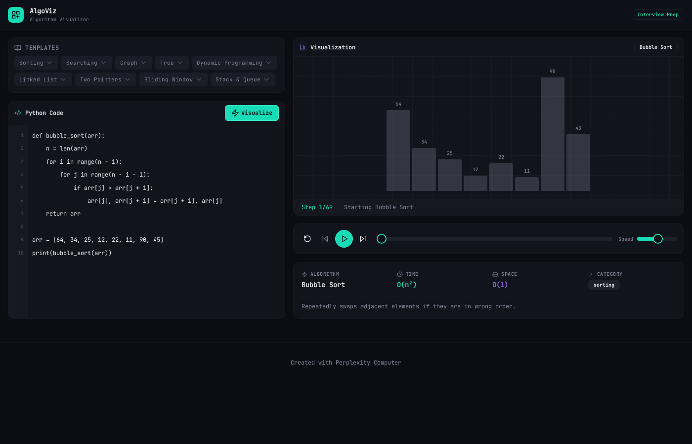

Mid-animation with comparison highlighting (teal bars):

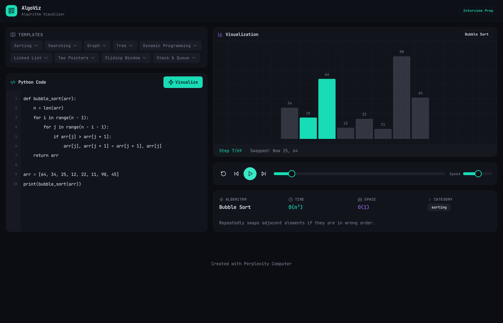

### Graph Visualization (BFS)

Circular graph layout with node A as starting point:

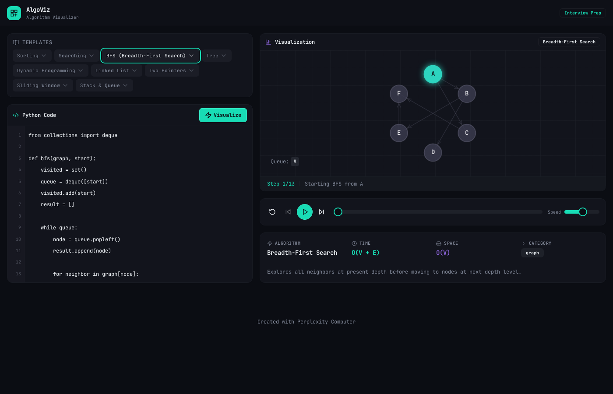

Mid-traversal with visited nodes (purple) and current node (teal glow):

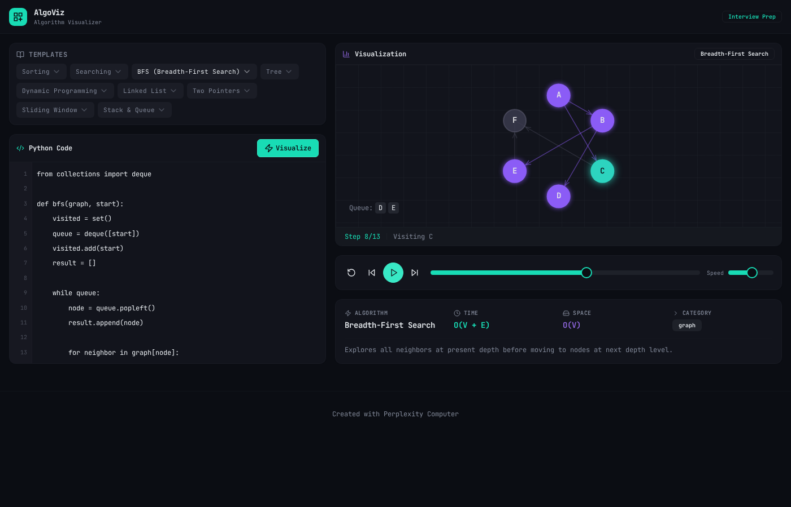

### Tree Visualization (Inorder Traversal)

Binary search tree with 7 nodes:

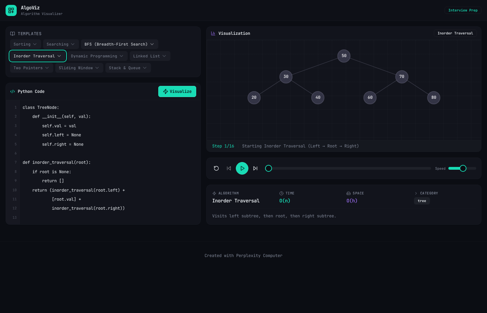

Mid-traversal with node highlighting and result array:

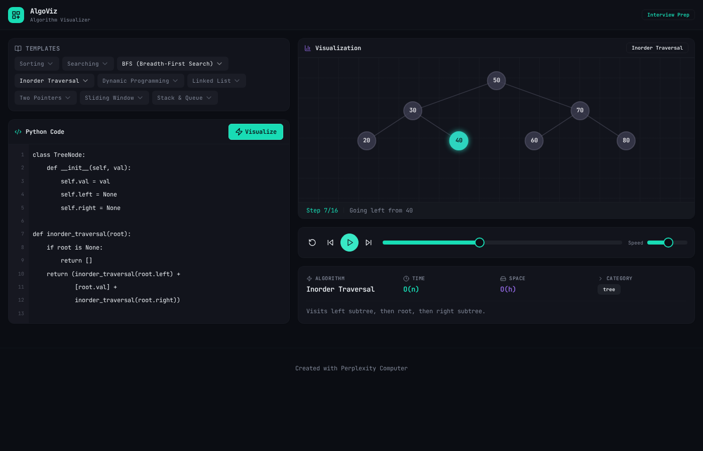

### Dynamic Programming (Fibonacci)

DP tabulation with values being filled left to right:

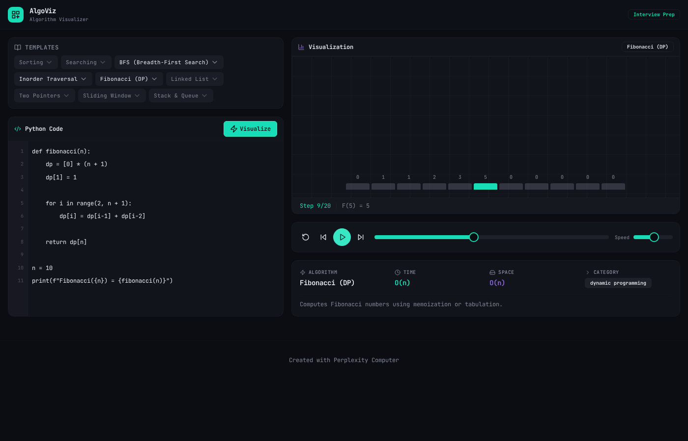

### Linked List (Reverse)

Node chain with pointer labels during reversal:

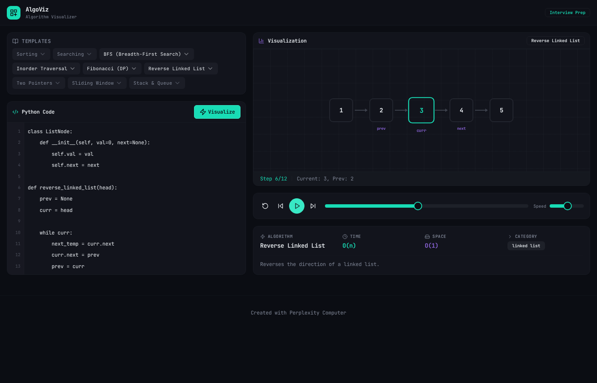

### Binary Search

Sorted array with low/mid/high pointer tracking:

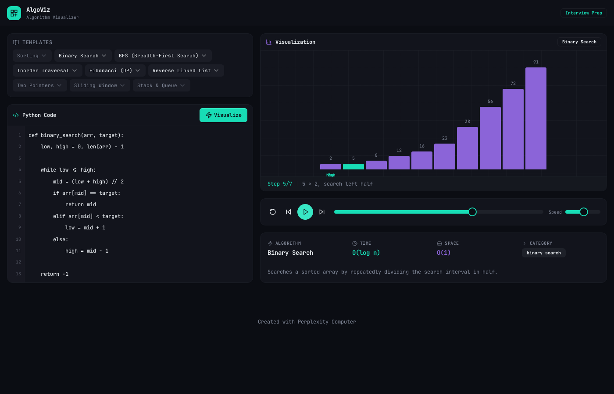

### Two Pointers

Left and right pointers converging toward target sum:

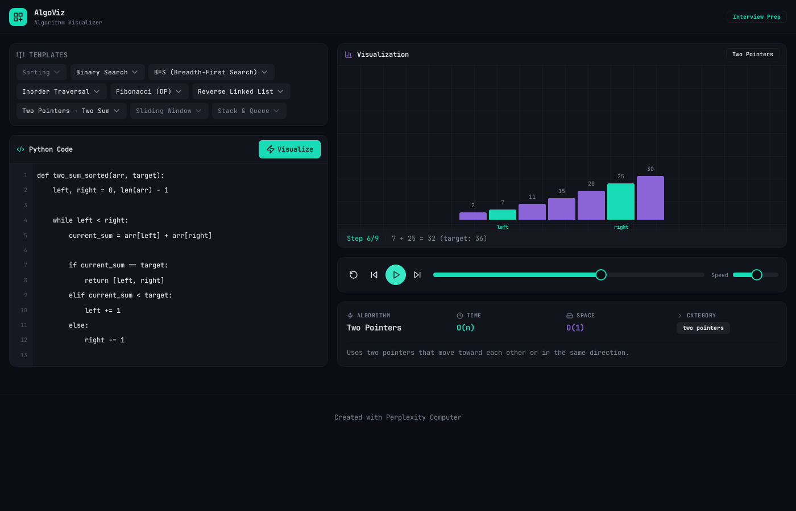

### Quick Sort

Pivot-based partitioning with pointer labels:

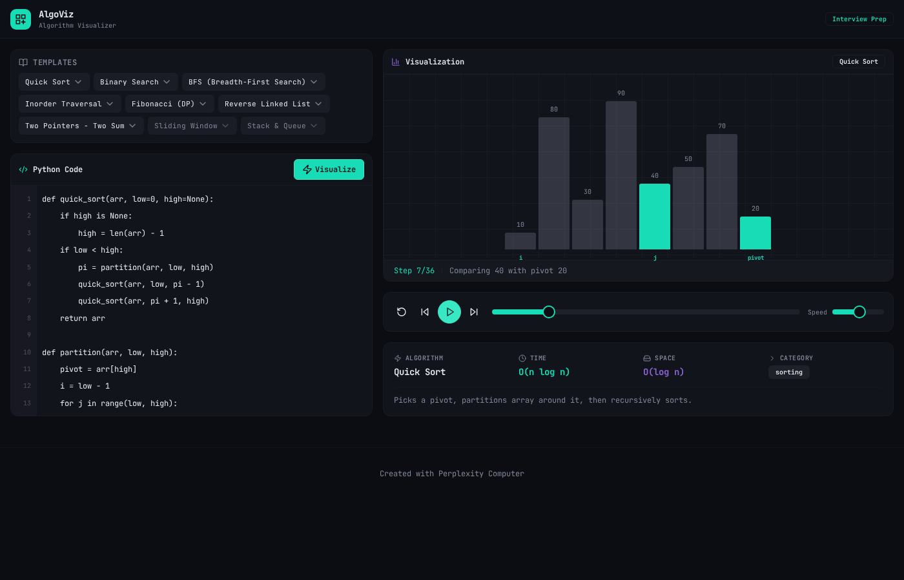

---

## 12. Data Flow

### User Action → Visual Update

```
User pastes code in textarea
  │
  ▼
code state updated (React useState)
  │
  ▼
User clicks "Visualize" button
  │
  ▼
handleVisualize() called
  │
  ├── detectAlgorithm(code) → DetectedAlgorithm
  │     └── Scans 40+ patterns, returns highest priority match
  │
  ├── extractArrayFromCode(code) / extractGraphFromCode(code) / etc.
  │     └── Parses data structures from the Python code
  │
  ├── generateSteps(algorithm, code)
  │     └── Switch on algorithm.type → call generator function
  │     └── Array.from(generator) → VisualizationStep[]
  │
  └── setState: detected, steps, currentStep=0
        │
        ▼
      React re-renders:
        ├── Visualization panel: renders steps[0] in appropriate visualizer
        ├── Info panel: shows algorithm name, complexity, description
        └── Controls: enabled with step count

User clicks Play
  │
  ▼
setInterval fires every {speed}ms
  │
  ▼
currentStep increments by 1
  │
  ▼
React re-renders visualizer with steps[currentStep]
  │
  ▼
Framer Motion animates bar changes (spring physics)
Canvas API redraws graph/tree (requestAnimationFrame implied)
  │
  ▼
Step message updates at bottom of visualization panel
```

### Template Selection Flow

```
User clicks category dropdown (e.g., "Graph")
  │
  ▼
SelectContent opens with algorithm options
  │
  ▼
User selects "BFS (Breadth-First Search)"
  │
  ▼
loadSample('bfs') called
  │
  ├── SAMPLE_CODES['bfs'].code → setCode(...)
  ├── detectAlgorithm(code) → setDetected(...)
  └── generateSteps(detected, code) → setSteps(...), setCurrentStep(0)
```

---

## 13. Algorithm Coverage Matrix

| Algorithm | Detection | Step Generator | Visualizer | Template | Time | Space |
|---|---|---|---|---|---|---|
| Bubble Sort | ✅ name + structural | ✅ | ArrayVisualizer | ✅ | O(n²) | O(1) |
| Selection Sort | ✅ name | ✅ | ArrayVisualizer | ✅ | O(n²) | O(1) |
| Insertion Sort | ✅ name | ✅ | ArrayVisualizer | ✅ | O(n²) | O(1) |
| Merge Sort | ✅ name + structural | ✅ | ArrayVisualizer | ✅ | O(n log n) | O(n) |
| Quick Sort | ✅ name + pivot pattern | ✅ | ArrayVisualizer | ✅ | O(n log n) | O(log n) |
| Heap Sort | ✅ name + heapify | ❌ fallback to bubble | ArrayVisualizer | ❌ | O(n log n) | O(1) |
| Binary Search | ✅ name + mid pattern | ✅ | ArrayVisualizer | ✅ | O(log n) | O(1) |
| Linear Search | ✅ name | ❌ fallback | ArrayVisualizer | ❌ | O(n) | O(1) |
| BFS | ✅ name + deque/queue | ✅ | GraphVisualizer | ✅ | O(V+E) | O(V) |
| DFS | ✅ name + recursive | ✅ | GraphVisualizer | ✅ | O(V+E) | O(V) |
| Dijkstra | ✅ name + heapq | ❌ fallback to BFS | GraphVisualizer | ❌ | O((V+E)logV) | O(V) |
| Topological Sort | ✅ name + in-degree | ❌ fallback | GraphVisualizer | ❌ | O(V+E) | O(V) |
| BST Insert/Search | ✅ TreeNode class | ✅ (inorder) | TreeVisualizer | ❌ | O(log n) | O(n) |
| Inorder Traversal | ✅ name | ✅ | TreeVisualizer | ✅ | O(n) | O(h) |
| Preorder Traversal | ✅ name | ✅ | TreeVisualizer | ❌ | O(n) | O(h) |
| Postorder Traversal | ✅ name | ✅ | TreeVisualizer | ❌ | O(n) | O(h) |
| Level Order | ✅ name | ❌ fallback | TreeVisualizer | ❌ | O(n) | O(w) |
| Fibonacci DP | ✅ name | ✅ | ArrayVisualizer | ✅ | O(n) | O(n) |
| Knapsack | ✅ name | ❌ fallback | ArrayVisualizer | ❌ | O(nW) | O(nW) |
| LCS | ✅ name | ❌ fallback | ArrayVisualizer | ❌ | O(mn) | O(mn) |
| LIS | ✅ name | ❌ fallback | ArrayVisualizer | ❌ | O(n²) | O(n) |
| Coin Change | ✅ name + coins/amount | ✅ | ArrayVisualizer | ✅ | O(n×amt) | O(amt) |
| Edit Distance | ✅ name | ❌ fallback | ArrayVisualizer | ❌ | O(mn) | O(mn) |
| Linked List Reverse | ✅ name + .next | ✅ | LinkedListVisualizer | ✅ | O(n) | O(1) |
| Cycle Detection | ✅ slow/fast pattern | ❌ fallback | LinkedListVisualizer | ❌ | O(n) | O(1) |
| Two Pointers | ✅ left/right pattern | ✅ | ArrayVisualizer | ✅ | O(n) | O(1) |
| Sliding Window | ✅ name + window | ✅ | ArrayVisualizer | ✅ | O(n) | O(k) |
| Stack Ops | ✅ push/pop pattern | ✅ | ArrayVisualizer | ✅ | O(1) | O(n) |
| Queue Ops | ✅ deque/popleft | ❌ fallback | ArrayVisualizer | ❌ | O(1) | O(n) |
| Heap Ops | ✅ heapq import | ❌ fallback | ArrayVisualizer | ❌ | O(log n) | O(n) |
| Trie | ✅ TrieNode/children | ❌ fallback | ArrayVisualizer | ❌ | O(L) | O(Σ×L×n) |
| Union-Find | ✅ find/union/parent | ❌ fallback | ArrayVisualizer | ❌ | O(α(n)) | O(n) |
| Segment Tree | ✅ name | ❌ fallback | ArrayVisualizer | ❌ | O(log n) | O(n) |
| N-Queens | ✅ name | ❌ fallback | ArrayVisualizer | ❌ | O(n!) | O(n²) |
| Permutations | ✅ name | ❌ fallback | ArrayVisualizer | ❌ | O(n!) | O(n) |
| Combinations | ✅ name | ❌ fallback | ArrayVisualizer | ❌ | O(C(n,k)) | O(k) |

**Legend**: ✅ = Fully implemented | ❌ = Detected but falls back to generic visualization

---

## 14. Technical Specifications

### Technology Stack

| Layer | Technology | Version | Purpose |
|---|---|---|---|
| UI Framework | React | 18.x | Component rendering |
| Language | TypeScript | 5.x | Type safety |
| Styling | Tailwind CSS | 3.x | Utility-first CSS |
| Components | shadcn/ui (Radix) | Latest | Accessible UI primitives |
| Animation | Framer Motion | Latest | Spring-based bar animations |
| Rendering | HTML5 Canvas API | Native | Graph and tree visualization |
| Icons | Lucide React | Latest | UI icons |
| Bundler | Vite | 5.x | Dev server + production build |
| Backend | Express | 4.x | Static file serving |
| Routing | Wouter | Latest | Hash-based SPA routing |
| Data Fetching | TanStack Query | v5 | Query caching (used for infra) |

### Browser Support

| Browser | Minimum Version | Notes |
|---|---|---|
| Chrome | 90+ | Primary target |
| Firefox | 90+ | Full support |
| Safari | 15+ | Full support |
| Edge | 90+ | Chromium-based |

### Build Output

| Metric | Value |
|---|---|
| HTML | 2.89 KB (1.06 KB gzip) |
| CSS | 72.83 KB (12.01 KB gzip) |
| JavaScript | 480.18 KB (154.59 KB gzip) |
| **Total** | **~556 KB** (~168 KB gzip) |

---

## 15. Performance Requirements

| Metric | Target | Actual |
|---|---|---|
| Detection time | < 10ms | < 1ms (synchronous regex) |
| Step generation (100 steps) | < 50ms | < 5ms (generator materialization) |
| Visualization render (per step) | < 16ms (60fps) | ~5ms (Framer Motion) / ~3ms (Canvas) |
| Initial page load | < 3s on 3G | ~2s (168KB gzip) |
| Time to interactive | < 2s | ~1.5s |

---

## 16. Non-Functional Requirements

### Accessibility
- Keyboard navigation for all controls (Tab, Enter, Space, Arrow keys)
- `aria-label` on icon-only buttons
- Semantic HTML (`header`, `main`, `footer`)
- Color contrast: WCAG AA compliant (4.5:1 on text)
- `data-testid` attributes on all interactive elements

### Security
- No code execution — Python code is only scanned with regex, never evaluated
- No user data stored (no database, no cookies, no localStorage)
- No external API calls from the client

### Reliability
- No server-side state — entire app works offline after initial load
- Graceful fallback for unknown algorithms ("Unknown Algorithm" message)
- Default datasets when data extraction from code fails

---

## 17. Known Limitations

| Limitation | Impact | Workaround |
|---|---|---|
| Detection is pattern-based, not AST-based | Obfuscated or unconventional code may not be detected | Use recognizable function names (e.g., `bubble_sort`) |
| Only Python syntax supported | JavaScript/Java/C++ code not detected | Rewrite algorithm in Python or use templates |
| No actual code execution | Cannot verify code correctness | Use the visualization to understand the algorithm, not to debug |
| Graph visualization limited to ~15 nodes | Large graphs become crowded | Keep test cases small |
| Tree visualization limited to ~4 levels deep | Deep trees overlap | Use balanced trees with fewer nodes |
| DP visualization is 1D only (array bars) | 2D DP tables (LCS, edit distance) not visually represented as matrices | The array shows the DP values but not the 2D table structure |
| No custom input data UI | Cannot change array values without editing code | Modify the array literal in the Python code |
| Steps are pre-generated | Very large inputs may consume memory | Keep input sizes reasonable (~20 elements) |

---

## 18. Success Metrics

| Metric | Target | Measurement |
|---|---|---|
| Algorithm detection accuracy | > 90% on standard LeetCode solutions | Manual testing against top 100 LeetCode problems |
| Visualization completeness | 100% of detected algorithms produce animation | Automated test: every template must generate > 0 steps |
| Step message clarity | Every step has a non-empty, descriptive message | Code review of generator functions |
| Playback smoothness | 60fps during animation | Chrome DevTools Performance tab |
| Template coverage | ≥ 1 template per supported category | Count templates per category |

---

## 19. Glossary

| Term | Definition |
|---|---|
| **Algorithm Detection** | The process of identifying which algorithm a piece of Python code implements, using regex pattern matching |
| **Step** | A single atomic operation in the algorithm (e.g., one comparison, one swap) represented as a `VisualizationStep` object |
| **Generator** | A JavaScript `function*` that yields steps one at a time, enabling lazy evaluation |
| **Phase** | A string label on each step (e.g., `init`, `compare`, `swap`, `done`) used for styling and logic |
| **Priority** | A 1–10 score assigned to each detection pattern, used to resolve conflicts when multiple patterns match |
| **Data Structure Type** | The category of visual representation (`array`, `graph`, `binary_tree`, `linked_list`) that determines which React component renders the step |
| **Template** | A pre-written Python code sample that demonstrates a specific algorithm, loaded via dropdown menus |
| **Neon Glow** | The CSS `box-shadow` effect used on active elements (teal/purple glow) |
